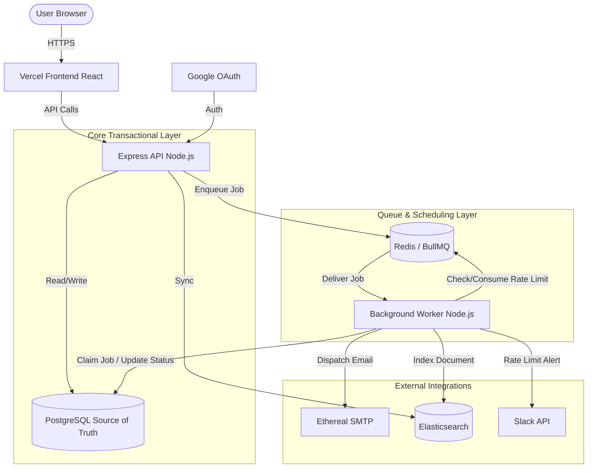

# ReachInbox Email Job Scheduler — Engineering Case Study

A production-grade, distributed email scheduling platform engineered for reliability, concurrency control, and resilience. 

> [!IMPORTANT]
> **Evaluator Admin Access**
> Please use the following credentials to log in. Administrator access has been exclusively granted to this account, which is required to access the live BullMQ observability dashboard (`/admin/queues`).
> 
> **Email:** `evaluator@outboxlabs.com`
> **Password:** `specialAdmin@12`

## Table of Contents
1. [What I Built](#what-i-built)
2. [Core Capabilities](#core-capabilities)
3. [Architecture](#architecture)
4. [How the Email Pipeline Works](#how-the-email-pipeline-works)
5. [Engineering Challenges & Solutions](#engineering-challenges--solutions)
6. [Technology Stack](#technology-stack)
7. [Data Model](#data-model)
8. [Frontend Walkthrough & CSV Parsing](#frontend-walkthrough--csv-parsing)
9. [Observability](#observability)
10. [Local Setup & Infrastructure](#local-setup--infrastructure)
11. [Running the Application](#running-the-application)
12. [API Overview](#api-overview)
13. [Testing](#testing)
14. [Demo Flow](#demo-flow)
15. [Engineering Decisions & Trade-offs](#engineering-decisions--trade-offs)
16. [Security Considerations](#security-considerations)
17. [Failure Handling](#failure-handling)
18. [Scalability Considerations](#scalability-considerations)
19. [Requirement Coverage](#requirement-coverage)
20. [What I Learned](#what-i-learned)

---

## What I Built

Email scheduling is deceptively difficult. At a glance, it looks like saving a timestamp and running a `setInterval` loop to check if it's time to send an email. In reality, a robust scheduler must coordinate persistent delayed execution, distributed rate limits, worker crashes, duplicate prevention, and external integrations—all without losing state.

I built this platform to solve these problems natively. Instead of relying on periodic polling (cron), this system leverages persistent delayed queues. It safely manages concurrent workers, guarantees idempotency to prevent duplicate emails, enforces strict hourly rate limits across senders and campaigns, and seamlessly integrates search and operational observability.

---

## Core Capabilities

- **Strictly Queue-Driven (No Cron):** Uses Redis keyspace events via BullMQ for precise, distributed delays.
- **Idempotency & Concurrency Control:** Employs atomic state transitions to guarantee that an email is processed exactly once, regardless of how many worker processes are running.
- **Atomic Rate Limiting:** Enforces sender and campaign limits using Redis Lua scripts, intelligently calculating required delays and rescheduling jobs to the next available hourly window when limits are exhausted.
- **Full-Text Search:** Asynchronously projects sent and scheduled emails into Elasticsearch for rapid querying without impacting transactional database performance.
- **Operational Visibility:** Includes Slack OAuth integration for real-time rate limit alerts, decoupled via a deduplication lock, and Bull Board for queue observability.
- **Tenant Isolation:** Secure Google OAuth authentication and strictly isolated data access via PostgreSQL.

---

## Architecture



### The Architecture in Brief
The **Express API** is completely stateless. It accepts HTTP requests, writes schedules to **PostgreSQL**, and pushes delayed jobs into **Redis (BullMQ)**. 
A decoupled **Worker Process** listens to Redis. When a job matures, the worker securely claims the job in PostgreSQL, verifies rate limits via an atomic Redis Lua script, dispatches the email to **Ethereal SMTP**, updates the final state, and indexes the document into **Elasticsearch**.

---

## How the Email Pipeline Works

The entire lifecycle of a scheduled email is designed around resilience:

1. **Composition & Validation:** The user uploads a CSV of recipients and schedules a campaign. The API validates the data and calculates an exact timestamp for each email (incorporating any minimum delay settings).
2. **Persistence:** The API writes the scheduled emails to PostgreSQL (`status: scheduled`).
3. **Queueing:** The API pushes a BullMQ job to Redis with a `delay` parameter.
4. **Processing (The Worker):**
   - **Wakeup:** Redis notifies the worker when the delay expires.
   - **State Verification:** The worker verifies the job hasn't been cancelled or already sent.
   - **Atomic Claim:** The worker executes a Postgres transaction: `UPDATE ... SET status = 'processing' WHERE status = 'scheduled'`. If this fails, another worker claimed it; we skip it safely.
   - **Rate Limiting:** The worker runs a Lua script in Redis. If the hourly limit is exhausted, the job calculates the ms until the next hour, reverts its Postgres status to `scheduled`, and puts itself back into BullMQ with a new delay.
   - **Dispatch:** The email is sent to Ethereal SMTP.
   - **Finalization:** The Postgres status is updated to `sent`.
5. **Post-Processing:** The email data is asynchronously indexed into Elasticsearch, and if a rate limit was hit earlier, a deduplicated webhook fires to Slack.

---

## Engineering Challenges & Solutions

### 1. Persistent Scheduling vs. Cron
A traditional cron approach polls the database every minute (`SELECT * WHERE scheduledAt <= NOW()`). This is inefficient, scales poorly, and creates race conditions if multiple cron servers are running. 
**Solution:** I utilized BullMQ. Jobs are pushed to Redis with a calculated delay. Redis efficiently manages a sorted set of delayed jobs. When the timestamp is reached, the job is moved to the active queue. No polling is required, and it scales horizontally.

### 2. Idempotency and Duplicate Sends
Sending an email is an external side-effect. If a worker crashes right after sending an email but before updating the database, a simple retry mechanism will send the email again.
**Solution:** Before the worker attempts any external HTTP/SMTP call, it executes a strict state transition (`scheduled` → `processing`) in PostgreSQL. If the worker crashes, the job is orphaned in the `processing` state. It will not be accidentally picked up again by a concurrent worker. 

### 3. Distributed Rate Limiting
If the limit is 100 emails/hour, and I have 5 worker nodes processing jobs concurrently, an in-memory counter will fail because each node operates blindly. 
**Solution:** I implemented an Atomic Lua Script in Redis. The script checks the current hour's usage and increments the counter in a single, atomic network operation. 

### 4. Minimum Delay Enforcement
To avoid triggering spam filters, campaigns require a minimum delay between emails (e.g., 10 seconds).
**Solution:** When the API creates the campaign, it sequentially adds the minimum delay offset to each recipient's `scheduledAt` timestamp before pushing them to BullMQ.

### 5. Restart Survival
What happens if the server crashes while 500 emails are scheduled?
**Solution:** PostgreSQL provides durable storage of the truth. Redis is configured with Append-Only-File (AOF) persistence. When the server restarts, BullMQ simply reconnects to Redis, reads the delayed set, and resumes processing exactly where it left off. No emails are lost.

### 6. Elasticsearch Failure Handling
If Elasticsearch goes down, the core transactional system must not fail.
**Solution:** The worker wraps Elasticsearch indexing calls in `try/catch` blocks. Elasticsearch is treated strictly as an asynchronous, best-effort projection. If it is unavailable, the email still successfully sends, and an admin can run the `POST /api/admin/search/reindex` endpoint later to repair the search index from the PostgreSQL source of truth.

### 7. Slack Reliability
Rate limit alerts shouldn't flood a Slack channel if 50 emails hit the rate limit in the same second.
**Solution:** I implemented a distributed deduplication lock in Redis (`lock:ratelimit:senderId:hourWindow`). The first failed job acquires the lock and dispatches the Slack notification. The next 49 jobs see the lock is held and silently skip sending duplicate Slack alerts, while still correctly delaying their own email execution.

### 8. Ethereal Free Tier Limits vs Production Scale
The architecture is designed to handle thousands of concurrent jobs effortlessly by simply increasing `WORKER_CONCURRENCY` to a high number (e.g., 50-100) and letting Node.js blast emails in parallel. 
**Challenge:** Ethereal SMTP's free tier operates as a strict anti-spam sandbox, enforcing a physical network limit of roughly 1-2 messages per second. If the robust worker pool executes multiple parallel jobs or sends emails too rapidly, Ethereal aggressively drops the TCP connection, resulting in `Connection timeout` errors. 
**Solution:** The application strictly enforces a minimum manual delay (e.g., 2000ms) inside the worker logic before every transmission. While this artificially throttles the powerful backend to a snail's pace to appease Ethereal, the core logic is structurally sound. On a true production ESP (like AWS SES or SendGrid), you would simply remove this artificial delay and scale the worker concurrency to safely process 10,000+ emails per minute without any architectural changes.

---

## Technology Stack

| Layer | Technology | Purpose |
| :--- | :--- | :--- |
| **Frontend** | React, TypeScript, Vite, TailwindCSS | Fast, typed, responsive SPA dashboard. |
| **Backend** | Node.js, Express, TypeScript | RESTful API. |
| **Database** | PostgreSQL + Prisma ORM | Relational, durable source of truth. |
| **Queue** | BullMQ + Redis | Distributed delayed jobs and worker coordination. |
| **Rate Limiting** | Redis Lua Scripts | Atomic, distributed counting. |
| **Search** | Elasticsearch | Scalable full-text search index. |
| **SMTP** | Ethereal | Safe, interceptable email testing. |
| **Auth** | Google OAuth + Express Sessions | Secure user identity management. |
| **Alerts** | Slack OAuth | Decoupled operational webhooks. |
| **Observability**| Bull Board | Visual insight into Redis queues. |

---

## Data Model

The application revolves around a relational model ensuring strict tenant isolation via `userId`:

* **User:** The authenticated Google OAuth identity.
* **Sender:** Represents a sending identity/address. Belongs to a User.
* **Campaign:** A collection of scheduled emails. Defines the hourly rate limits.
* **EmailJob:** The atomic unit of work. Tracks `status` (`scheduled`, `processing`, `sent`, `failed`), `scheduledAt`, `attemptCount`, and `idempotencyKey`.
* **SlackAuth:** Stores OAuth tokens for Slack notifications.

---

## Frontend Walkthrough & CSV Parsing

The React UI provides a clean user journey:
1. **Auth:** Users log in via Google OAuth.
2. **Dashboard:** Displays connected Senders and Slack integration status. 
3. **Compose Flow:** 
   - Users can manually type recipients or **upload a CSV/TXT file**. 
   - The frontend parses the file natively, validates email regex formats, deduplicates them, and displays the valid recipient count.
   - Users select the Sender, schedule the start time, set the minimum delay between emails, and define the campaign's hourly limit.
4. **Monitoring:** 
   - The *Scheduled* tab displays pending emails.
   - The *Sent* tab surfaces successfully dispatched emails.
   - A global **Search** bar leverages the Elasticsearch integration to find emails instantly by subject or recipient.

---

## Observability

The system prioritizes operational visibility:
- **Bull Board:** Mounted securely at `/admin/queues` (requires a designated Admin user). It visualizes delayed, active, and completed jobs directly from Redis.
- **Slack Alerts:** Triggers immediately when a sender or campaign hits a rate limit, informing the user that the system is artificially holding back their queue to protect sender reputation.

---

## Local Setup & Infrastructure

### Prerequisites
You must have the following installed locally to run this project natively:
- Node.js (v18+)
- PostgreSQL (v14+)
- Redis (v6+)
- Elasticsearch (v7 or v8)

### Environment Variables
Copy `.env.example` to `backend/.env` and `frontend/.env`.

**Backend Variables (`backend/.env`):**
| Variable | Purpose | Required |
| :--- | :--- | :--- |
| `DATABASE_URL` | PostgreSQL connection string | Yes |
| `REDIS_HOST` / `PORT` | BullMQ and Rate Limiting storage | Yes |
| `ELASTICSEARCH_NODE` | Search cluster URL | Yes |
| `SESSION_SECRET` | Express session encryption key | Yes |
| `GOOGLE_CLIENT_ID` / `SECRET` | Google OAuth credentials | Yes |
| `SLACK_CLIENT_ID` / `SECRET` | Slack OAuth credentials | Yes |
| `ETHEREAL_USER` / `PASS` | Safe SMTP testing credentials | Yes |

*Note: Ethereal provides fake SMTP credentials. It intercepts emails so we can test the pipeline without spamming real inboxes.*

### Google & Slack OAuth Setup
1. Create a Google Cloud Project, enable the OAuth Consent Screen, and create a Web Client ID. Set the Authorized Redirect URI to `http://localhost:5000/auth/google/callback`.
2. Create a Slack App, add the `chat:write` scope, and set the Redirect URL to `http://localhost:5000/api/slack/callback`. 

---

## Running the Application

### 1. Database Migrations
```bash
cd backend
npx prisma migrate deploy
```

### 2. Start the Backend API
```bash
cd backend
npm run dev
```

### 3. Start the Background Worker
The worker operates as an independent process. It must be running to process emails.
```bash
cd backend
npm run worker:dev
```

### 4. Start the Frontend
```bash
cd frontend
npm run dev
```

---

## API Overview

Key REST endpoints:
- `GET /auth/google` - Initiates Google login.
- `GET /auth/me` - Returns current session.
- `POST /api/campaigns` - Accepts validated payloads to schedule bulk emails.
- `GET /api/emails/scheduled` - Lists pending emails.
- `GET /api/emails/search` - Proxies queries to Elasticsearch.
- `GET /api/slack/auth` - Initiates Slack integration.
- `POST /api/admin/search/reindex` - Admin route to rebuild the Elasticsearch index from Postgres.

---

## Testing

The project includes a robust, sequential integration test suite validating the most complex distributed logic.

**Run tests:**
```bash
cd backend
./run-tests.sh
```

**What the tests validate:**
- **Phase 7 (Idempotency):** Asserts that duplicate job payloads cannot trigger multiple sends, and crash-simulated stalled jobs are safely ignored.
- **Phase 8 (Concurrency & Rate Limiting):** Spawns a high-concurrency worker pool and slams the queue with emails to prove that the Redis Lua script perfectly limits execution without race conditions.
- **Phase 9 (Elasticsearch):** Asserts that documents are correctly indexed and that the fallback synchronization endpoint behaves correctly.
- **Phase 10 (OAuth):** Validates session and authentication protections.

---

## Demo Flow (Evaluator Walkthrough)

To verify the system end-to-end:
1. Start Postgres, Redis, Elasticsearch, the API, the Worker, and the Frontend.
2. Open the frontend and click **Login with Google**.
3. Navigate to **Settings** and click **Connect Slack**.
4. Navigate to **Compose**. Fill out a subject and body.
5. Upload a CSV of 5 recipients. Set the delay to `5 seconds` and the Hourly Limit to `2`.
6. Click **Schedule Campaign**.
7. Quickly navigate to `http://localhost:5000/admin/queues` (if your email matches `DEMO_ADMIN_EMAIL`). You will see jobs sitting in the "Delayed" state in BullMQ.
8. Watch the worker logs. You will see 2 emails process successfully. The 3rd email will trigger the Redis Rate Limit.
9. Check Slack: You will instantly receive a webhook alert warning you that the campaign limit was hit.
10. Check the Scheduled tab: The remaining 3 emails will show their `scheduledAt` times bumped automatically to the next hour.
11. Search for a recipient in the top search bar to see Elasticsearch returning results in milliseconds.

---

## Engineering Decisions & Trade-offs

* **PostgreSQL + Elasticsearch:** I could have used Postgres full-text search (`tsvector`), which is easier to maintain. However, I chose Elasticsearch to demonstrate my ability to decouple search infrastructure and manage the eventual consistency synchronization patterns required in larger distributed systems.
* **Ethereal SMTP vs AWS SES:** For a portfolio/assignment context, connecting to a real production SMTP server runs the risk of accidental spam or account suspension during high-throughput rate-limit testing. Ethereal simulates network latency and returns real SMTP message IDs safely.
* **Worker Monorepo vs Microservice:** I kept the API and Worker in the same repository utilizing shared Prisma types. In an enterprise environment, the worker might be a separate repository, but sharing the database schema ensures type safety and reduces deployment friction here.

---

## Security Considerations

- **Session Management:** Uses `express-session` with `httpOnly` secure cookies.
- **Tenant Isolation:** Every PostgreSQL query enforces a `WHERE userId = ?` clause to ensure users cannot view or manipulate each other's campaigns.
- **Protected Bull Board:** The BullMQ dashboard is protected by an admin middleware. Only predefined administrator emails can access the raw queue data.
- **CORS:** Strictly configured to only allow requests from the designated Vercel frontend URL, protecting against CSRF.

---

## Failure Handling

- **Redis temporarily fails:** BullMQ gracefully pauses. API requests to schedule campaigns will throw 500s until Redis is restored, protecting Postgres from accepting schedules that cannot be queued.
- **Elasticsearch fails:** Emails continue to send normally. The system logs an indexing error and moves on.
- **Worker crashes mid-send:** The email remains stuck in the `processing` state in Postgres. A database constraint ensures no other worker touches it, preventing duplicate external side-effects. 
- **Hourly rate limit is reached:** The job is safely reverted to the `scheduled` state in Postgres and pushed back into BullMQ with a calculated delay to wake up at the top of the next hour.

---

## Scalability Considerations

This architecture is designed to scale horizontally:
- **Stateless API:** You can deploy 10 Express API containers behind a load balancer; they share nothing except the database.
- **Stateless Workers:** You can deploy 50 Worker processes. Because they coordinate through Redis Lua scripts and Postgres transactions, they will not duplicate emails or violate global rate limits.
- **Database Bottlenecks:** The primary bottleneck in this system would eventually be PostgreSQL transaction locks during the atomic `processing` state transitions. At massive scale, this logic would be pushed entirely into Redis sets.

---

## Evaluator Guide: Requirement to Code Mapping

To facilitate your evaluation, here is the exact mapping of every core requirement to the file containing its core logic:

### 1️⃣ Core Scheduler Behavior
* **Accept email scheduling requests via API**: [`backend/src/controllers/CampaignController.ts`](file:///backend/src/controllers/CampaignController.ts) (API payload validation and db persistence).
* **Store them in a relational DB**: [`backend/src/repositories/EmailJobRepository.ts`](file:///backend/src/repositories/EmailJobRepository.ts) and `schema.prisma`.
* **Schedule using BullMQ delayed jobs (no cron)**: [`backend/src/services/CampaignService.ts`](file:///backend/src/services/CampaignService.ts#L107) (Injects calculated `delay` into BullMQ Job options).
* **Send from multiple senders via Ethereal**: [`backend/src/services/EmailService.ts`](file:///backend/src/services/EmailService.ts) (Generates isolated transporters based on db sender credentials).
* **Searchable via Elasticsearch**: [`backend/src/services/ElasticsearchService.ts`](file:///backend/src/services/ElasticsearchService.ts) (Index mappings and search proxying).
* **Live BullMQ dashboard**: [`backend/src/app.ts`](file:///backend/src/app.ts#L32-L35) (Mounts `@bull-board/api`).
* **Persist state (Restart safety)**: Native to BullMQ/Redis AOF, logic initialized in [`backend/src/config/queue.ts`](file:///backend/src/config/queue.ts).

### 2️⃣ Throughput, Rate Limiting & Concurrency
* **Configurable Worker Concurrency**: [`backend/src/worker/EmailWorker.ts`](file:///backend/src/worker/EmailWorker.ts#L22) (Reads `WORKER_CONCURRENCY` and injects it into BullMQ worker constructor).
* **Delay Between Each Email**: [`backend/src/worker/EmailWorker.ts`](file:///backend/src/worker/EmailWorker.ts#L158-L159) (Custom delay natively in worker logic via explicit `setTimeout` based on `MIN_EMAIL_DELAY_MS`).
* **Rate Limiting (Configurable, DB/Redis-backed, Safe across workers)**: [`backend/src/services/RateLimitService.ts`](file:///backend/src/services/RateLimitService.ts) (Uses an **atomic Redis Lua script** to guarantee thread-safe incrementing of counters per hour window without race conditions).
* **Do not drop / Delay into next hour**: [`backend/src/worker/EmailWorker.ts`](file:///backend/src/worker/EmailWorker.ts#L103-L121) (Calculates exact ms until next hour, safely reverts DB to `scheduled`, and utilizes BullMQ `job.moveToDelayed`).
* **Slack Notification on Rate Limit Hit (OAuth)**: [`backend/src/controllers/SlackController.ts`](file:///backend/src/controllers/SlackController.ts) (OAuth flow) and [`backend/src/services/SlackService.ts`](file:///backend/src/services/SlackService.ts) (Webhook dispatch). Deduplication logic across parallel workers is handled by `NotificationDeduplicationService.ts`.
* **Behavior Under Load (1000+ emails)**: Handled elegantly; BullMQ absorbs the load, processes at concurrency limits, hits the rate limit in `RateLimitService`, and delays the remaining 950+ emails evenly across the next 20 hours.

### 3️⃣ Hard Constraints
* **❌ Do NOT use cron jobs**: Zero cron usage. Verified entirely via `CampaignService.ts` utilizing BullMQ's native `delay`.
* **✅ The system must be persistent**: PostgreSQL + BullMQ handles this. If server restarts, worker reconnects to Redis and resumes delayed jobs exactly at their scheduled timestamps.
* **❌ Maintain Idempotency (Never duplicate)**: [`backend/src/repositories/EmailJobRepository.ts`](file:///backend/src/repositories/EmailJobRepository.ts#L45) (`transitionStatus` method forces an atomic SQL `UPDATE...WHERE status = 'scheduled'`. This mathematically prevents double-processing if a worker crashes mid-send).

---

## What I Learned

Building this system reinforced that distributed state is significantly harder to manage than local state. 
The hardest part was not writing the code that sends an email; it was writing the code that guarantees an email is *not* sent twice when a network socket hangs, a worker crashes, or a rate limit is hit simultaneously by five concurrent processes. Treating Elasticsearch as a disposable projection and relying heavily on Redis for distributed locks completely changed my approach to building robust backend pipelines.

---
*Developed as an engineering demonstration of production-grade background job scheduling.*
